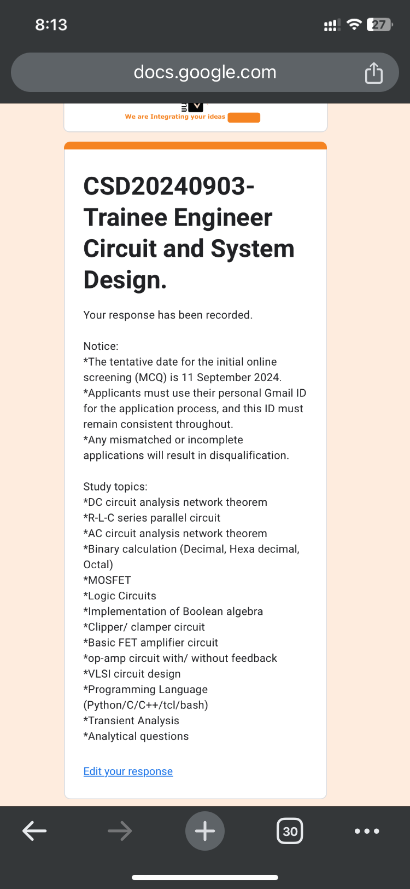

<!--Probability Experiment-->
This is experiment <br/>
A dice is used for this experiment .This is mark down
 ---
 # h1 tag
 ## h2 
 ### h3
 #### h4
 ##### h5
 ###### h6
 This is tanvir.

 ~~this is~~  
  `This is inline` <br/> 
  `<h1>thsfdf </h1>`
```html
<onek l>ine code <likhbo>
```
## task item
- [x] task 1
- [x] task 1
- [] task 1

## link  
http://www.google.com

## link disable
`http://www.google.com`

## markdown link syntax
[google][onek link]
[facebook][facebook link]

## onek gulo link
[onek link]: http://www.google.com 
[facebook link]: http://www.facebook.com 

## image syntax

<!---->


